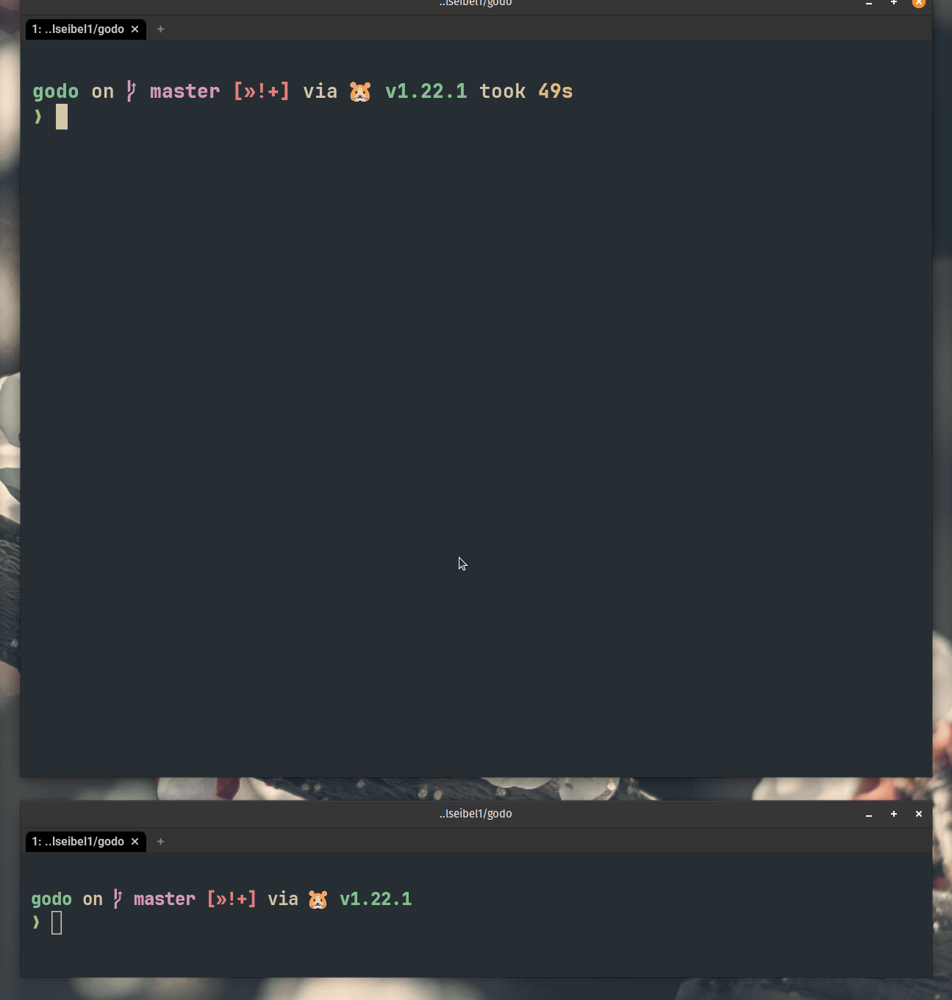

# GoDo

[](https://github.com/gabrielseibel1/godo/actions/workflows/go.yml)

[](https://goreportcard.com/report/github.com/gabrielseibel1/godo)
[](https://github.com/gabrielseibel1/godo)

GoDo is a ToDo application written in Go.



## Installation

```sh
go install github.com/gabrielseibel1/godo@latest
```

## Usage

To run the application have it installed and then:

```sh
godo help
```

This will explain the syntax expected for the commands.

```txt
usage: ./godo [command] [args]
        [command] = {list|get|create|delete|do|undo|work|help}
```

For now the arguments [args] are not documented, but you can learn from an example:

```sh
# create an item called "id1"
godo create id1 "description for item id1"
# spend some time on the item
godo work id1 1h23m
godo do id1
# realize item should be reopened
godo undo id1
# work some more
godo work id1 42m87s
# finish-up again
godo do id1
# ...time goes on and you don't want to keep the item anymore
godo delete id1
```

## Dashboard

```sh
godo
```

Use the dashboard to monitor the todo list edits from other terminal windows.

